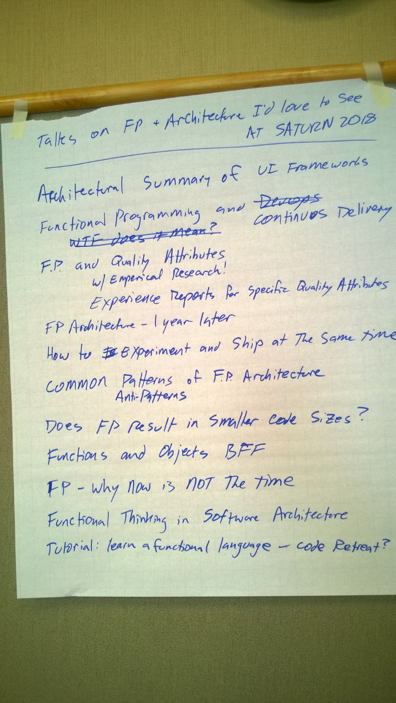

# Talks on FP + architecture We'd Love to see at Saturn 2018

Based on today's discussions, what topics would you like to see explored
further?

* Architectural summary of UI Frameworks
* Functional programming and continuous delivery
* Functional programming and quality attributes with empirical research
* Experience reports on specific quality attributes with functional
  programming
* FP architecture one year later
* How to experiment and ship at the same time
* Common patterns of FP architecture and anti-patterns
* Does FP result in smaller code size?
* Functions and objects BFF (Best Friends Forever)
* FP: why is now not the time
* Functional thinking in software architecture
* Tutorial: learn a functional language, code retreat

