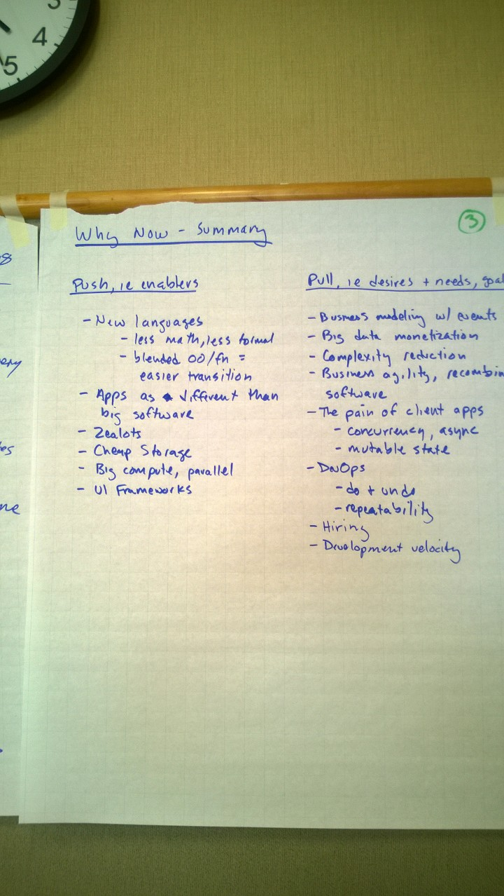

# Why Now?

Summary

Push - enablers
* New languages 
* Less math, less formal
* Blended OO/FP = easier transition
* Apps as different than big software
* Zealots
* Cheap storage
* Big compute, parallel
* UI frameworks

Pull - desires + needs, goals
* Business modeling with events
* Big data monetization
* Complexity reduction
* Business agility, recombine software
* The pain of client apps
* Concurrency, asynchronicity 
* Mutable state
* Devops
* Do + undo
* Repeatability
* Hiring
* Development velocity

## Raw Notes

Computing has changed
* Bigger, now cloud computing is available
* Microservices is functionality, close to FP at computer scale
* Kubernates API to connect microservices
* Like a pipe
 
Who did FP in the past?
* Sci apps, Fortran
 
Map/reduce

Transformation steps
 
Predictability, easy to undo when something goes wrong

Neural networks as a driver, yet the network is unpredictable
 
Time to popularize
* Frameworks, languages (scale, swift)
* Some C# features have functional aspects
* Lambdas in mainstream languages
 
Hype cycle
* Push + pull,  tech and business
* Collecting “big data” for years, not finally using it
 
Zealats (see: Clojore)
* Tech refresh for next career (resume driven development)
* Boredom
* Prefer the ones who are not language specific

Events
* Business + product are biggest proponents
* At powerpoint level can see the business reflect it in software
* Removes the SW abstractions
* Easy for business to relate to events
* Developers bad at managing time, events force focus on time + sequence
* Developers like the asynchronous model
* Events mirror world’s dynamics

Monetizing data capture, “big data”

Pushes
* Cloud computing
* Simpler languages (less math)
* Storage

Pull
* Big data monetization
* Business agility (reasoning, composition) ⇒ microservices
* DevOps, do + undo, repeatability
* App programming model - simple programs with simple goal
* Fix issues of Java’s mutability

UI/Frontend development
* JS is hard at scale
* Big frameworks like Angular push FP borrowed from Flex
* State + callbacks are hard in JS, so FP helps
* Do UI programmers chase trends or innovators?
* Powerbuilder easy, Jaba hard, trying to get there again
* Adopting event based from other domains
* Pain high
* Frequency of rewrites in UI?
* Apps age like fish, data ages like wine

